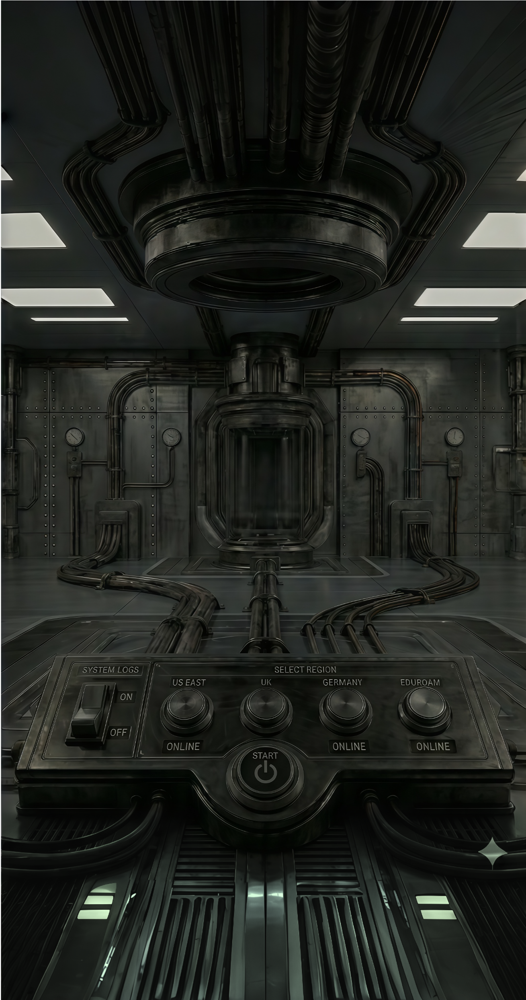
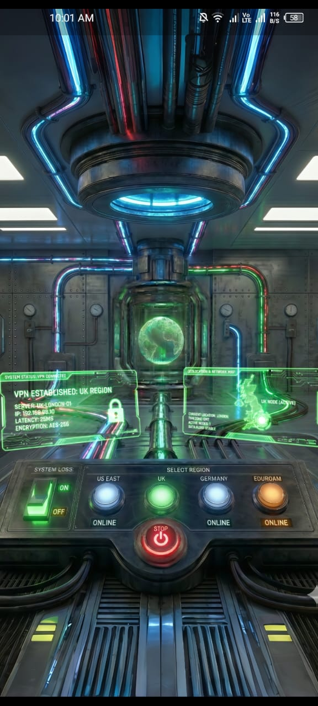

<div align="center">

# ⚡ SYSTEM LINK VPN
### Next-Gen Interface. Industrial Security.

[](https://flutter.dev/)
[](https://dart.dev/)
[](https://flutter.dev/)
[](./LICENSE)

<br />

**System Link VPN** redefines network utility apps by replacing standard toggles with a **cinematic, industrial sci-fi interface**. This project showcases high-fidelity UI engineering, complex state management, and fluid animations that simulate a physical reactor core powering up.

</div>

---

## 🖥️ Overview

System Link puts the user in control of a high-tech network reactor. Instead of a simple "Connect" button, the app features a tactile, multi-stage power-up sequence. Every interaction—from flipping the heavy mechanical switches to selecting a region—triggers detailed animations, creating a deeply immersive user experience.

This project focuses purely on **Advanced UI/UX Implementation**, demonstrating how Flutter can be used to build game-quality interfaces for utility applications.

## ✨ Key Features

### 🔌 Sequential Power-Up Engine
A realistic, multi-stage startup sequence. The system doesn't just turn on; it boots up:
1.  **Dashboard Initialization:** Control lights flicker to life.
2.  **Energy Flow:** Custom liquid-fill animations simulate power flowing through pipes.
3.  **Core Ignition:** The central reactor globe spins up and stabilizes.

### 🌐 Holographic Projection UI
Region selection is confirmed via **Blend-Mode Rendered Holograms**. Selecting a server (US, UK, Germany) projects a glowing digital map over the physical machinery, blending seamlessly with the dark industrial background using `BlendMode.screen`.

### ⚠️ Smart Diagnostic Overlays
Demonstrates advanced visual hierarchy with a dedicated **Eduroam Error Simulation**.
* **Dynamic Alerting:** If the connection fails (simulated for Eduroam), the system interrupts the power flow.
* **Visual Feedback:** A high-contrast Red Alert overlay fades in above the machinery, providing clear, instant status feedback to the user.

### 🌊 Fluid "Liquid" Animations
Utilization of **Masked Shaders** and `AnimationControllers` to create wires that appear to fill with electricity or data, moving organically from the control panel to the core.

---

## 📸 Interface Preview

| **System Off** | **Power Sequence** | **Connection Successfull** | **Error Diagnostics** |
|:---:|:---:|:---:|:---:|
|  |  |  |  |

*(Note: Replace the paths above with your actual screenshots or GIFs for the best effect on GitHub)*

---

## 🛠️ Technical Stack

* **Framework:** [Flutter](https://flutter.dev/)
* **Language:** [Dart](https://dart.dev/)
* **State Management:** `StatefulWidget` & `setState` (Optimized for local UI state)
* **Animation:** `AnimationController`, `Tween`, `Interval`, `CurvedAnimation`
* **Rendering:** `CustomPainter`, `ShaderMask`, `BlendMode` composites

---

## 🚀 Getting Started

1.  **Clone the repository**
    ```bash
    git clone [https://github.com/yourusername/system-link-vpn.git](https://github.com/yourusername/system-link-vpn.git)
    ```

2.  **Install dependencies**
    ```bash
    cd system_link_vpn
    flutter pub get
    ```

3.  **Run the app**
    ```bash
    flutter run
    ```

---

<div align="center">

### Designed & Engineered with 💙 in Flutter

</div>
